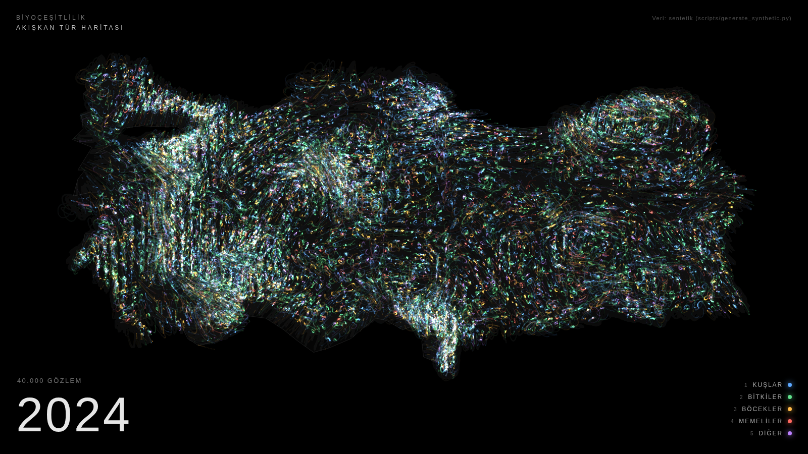

# Akışkan Tür Haritası

Türkiye'nin biyoçeşitliliğini bir veri sanatı sergisine dönüştüren p5.js projesi.
Refik Anadol'un veri heykellerinden esinlenir: gerçek bir veri kümesi alınır,
algoritmayla görselleştirilir, karanlık bir duvara yansıtılır.

Her tür gözlemi bir parçacıktır. Gözlemin yapıldığı noktada doğar, görünmez bir
akış alanı tarafından sürüklenir, iz bırakır, söner ve o yılın başka bir
gözleminde yeniden doğar. Renk taksonomik sınıfı, parlaklık yoğunluğu anlatır.
Zaman 1950'den bugüne yıl yıl akar.

| 1971 | 2024 |
|------|------|
|  |  |

## Hızlı başlangıç

Sunucuya gerek yok. `index.html` dosyasına çift tıklayın, tarayıcıda açılır.
Şu an depoda sentetik (üretilmiş) veri var; gerçek veriyi bağlamak için aşağıya bakın.

Sergi günü için: tarayıcıda **F** ile tam ekran yapın, **H** ile yazıları gizleyin.
Sayfa internet gerektirmez; p5.js `lib/` klasöründe yerel olarak durur.

## Klavye

| Tuş | İşlev |
|-----|-------|
| Boşluk | Durdur / devam |
| ← → | Bir yıl geri / ileri |
| ↑ ↓ | Zamanı hızlandır / yavaşlat |
| 1 - 5 | Sınıfı aç / kapat (kuşlar, bitkiler, böcekler, memeliler, diğer) |
| F | Tam ekran |
| H | Yazıları gizle / göster |
| L | Kıyı çizgisini aç / kapat |
| R | Baştan başla |
| S | PNG olarak kaydet |
| D | FPS ve parçacık sayısını göster |

Fare hareketi parçacıkları hafifçe iter. İleride web kamera ile izleyici
hareketine bağlanabilir.

## Gerçek veri: GBIF

1. [gbif.org/occurrence/search](https://www.gbif.org/occurrence/search) adresinde ücretsiz hesap açın.
2. Filtreler: **Country = Turkey**, **Has coordinate = true**, **Occurrence status = present**.
3. **Download → Simple** seçin. E-postayla gelen zip'i açın; içinde tab ile ayrılmış bir CSV vardır.
4. Dönüştürün:

```bash
python3 scripts/prepare_gbif.py yol/0012345-2409.csv -n 80000
```

Betik dosyayı satır satır okur (milyonlarca satır olabilir), Türkiye kutusu dışındaki
hatalı koordinatları atar, rastgele 80 bin kayıt örnekler ve `data/observations.json`
ile `data/observations.js` dosyalarını yazar. Sayfayı yenileyin, biter.

Sentetik veriyi yeniden üretmek için:

```bash
python3 scripts/generate_synthetic.py -n 40000 --seed 1
```

### Veri formatı

```json
{
  "meta": { "source": "...", "classes": ["Kuşlar", "Bitkiler", "Böcekler", "Memeliler", "Diğer"],
            "yearMin": 1950, "yearMax": 2024, "count": 40000 },
  "obs": [[boylam, enlem, yıl, sınıfIndeksi], ...]
}
```

Kendi verinizi (örneğin FTC robotunun sensörlerinden) bu formata çevirirseniz doğrudan çalışır.

## Ayarlar

Tüm parametreler `sketch.js` başındaki `CONFIG` nesnesinde, Türkçe açıklamalarıyla.
Hepsi URL'den de verilebilir, dosyaya dokunmadan denemek için:

```
index.html?particles=40000&secondsPerYear=1.5&fade=0.03&seed=7
```

Sık ayarlanacaklar:

- `particles`: parçacık sayısı. Zayıf bilgisayarda 12000, güçlüde 50000.
- `secondsPerYear`: bir yılın kaç saniye sürdüğü. 2.0 ile tam döngü yaklaşık 2.5 dakika.
- `fade`: iz uzunluğu. Küçük değer uzun, boyalı iz; büyük değer kısa, net iz.
- `alpha`, `alphaRefAlive`: parlaklık ve beyaza doyma dengesi.
- `noiseScale`, `flowForce`, `homePull`: akışın karakteri. `homePull` sıfıra yaklaşınca harita dağılır.
- `seed`: aynı tohum aynı akışı üretir; beğendiğiniz görüntüyü yeniden bulabilirsiniz.

## Dosyalar

```
index.html               sayfa iskeleti, yazı katmanı, stiller
sketch.js                p5.js algoritması: parçacıklar, akış alanı, zaman, klavye
lib/p5.min.js            p5.js 1.9.4 yerel kopyası (çevrimdışı çalışma için)
data/observations.*      gözlem verisi (json ve js kopyası)
data/turkey_outline.*    kaba Türkiye kıyı ve sınır çizgisi
scripts/generate_synthetic.py   sentetik veri üretici
scripts/prepare_gbif.py         GBIF CSV -> sergi formatı
scripts/common.py               ortak sınıf eşlemesi ve çıktı yazımı
KONSEPT.md               sergi metni ve algoritmik yaklaşım
docs/                    önizleme görüntüleri
```

## Sergi metni için önemli not

Yıllar aktıkça parçacık sayısının patlaması **türlerin arttığı** anlamına gelmez.
Artan şey gözlem sayısıdır: iNaturalist ve eBird gibi vatandaş bilimi uygulamaları
2010'lardan sonra kayıtları katladı. Bu fark sergi açıklamasında dürüstçe yazılmalı.
Jüri karşısında bu ayrımı yapabilmek, işin bilimsel değerini gösterir.

## Yol haritası

- [ ] Gerçek GBIF verisi
- [ ] Ses katmanı: o yılın kuş sesleri (Xeno-canto)
- [ ] Web kamera ile izleyici hareketine tepki
- [ ] FTC robotunun sensör verisinden canlı katman
- [ ] WebGL sürümü: 100 bin+ parçacık
