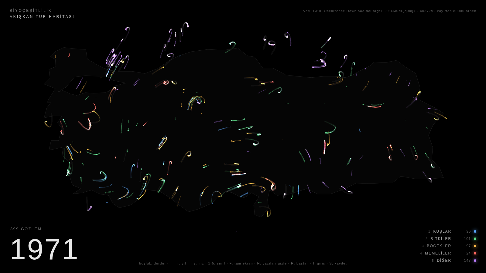
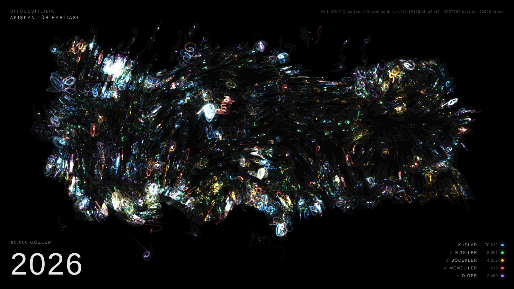
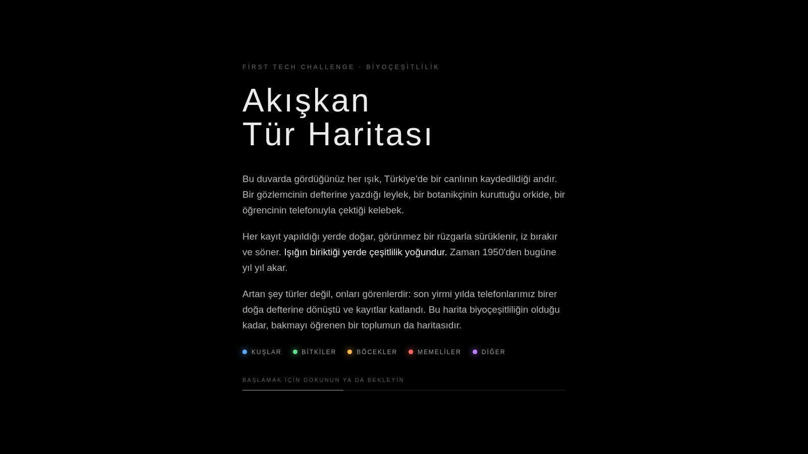

# Akışkan Tür Haritası

Türkiye'nin biyoçeşitliliğini bir veri sanatı sergisine dönüştüren p5.js projesi.
Refik Anadol'un veri heykellerinden esinlenir: gerçek bir veri kümesi alınır,
algoritmayla görselleştirilir, karanlık bir duvara yansıtılır.

Her tür gözlemi bir parçacıktır. Gözlemin yapıldığı noktada doğar, görünmez bir
akış alanı tarafından sürüklenir, iz bırakır, söner ve o yılın başka bir
gözleminde yeniden doğar. Renk taksonomik sınıfı, parlaklık yoğunluğu anlatır.
Zaman 1950'den bugüne yıl yıl akar.

| 1971 | 2026 |
|------|------|
|  |  |

## Giriş ekranı

Sergi açılışta ve her döngü başında izleyiciye işi anlatan bir giriş gösterir.
Metin satır satır belirir, alttaki çizgi dolunca harita başlar. Dokunuş veya
herhangi bir tuş erken başlatır. **I** tuşu girişi yeniden gösterir.



Metni değiştirmek için `index.html` içindeki `<div id="intro">` bölümünü düzenleyin;
takım adınızı en üstteki küçük satıra yazın. Süre `CONFIG.introSeconds` ile
ayarlanır (0 kapatır), `introEachLoop: 0` girişi yalnızca açılışta gösterir.

## Ses

Ses de veriden üretilir; dış ses dosyası yok, her şey tarayıcının Web Audio motorunda
anlık sentezlenir (`sound.js`):

- **Doğum notaları:** parçacık doğduğunda sınıfına göre bir tını çalar. Kuşlar kısa, yukarı
  kayan cıvıltı; bitkiler yumuşak uzun pad; böcekler çok kısa tık; memeliler alçak vuruş;
  diğerleri çan. Perde enleme göre pentatonik dizide seçilir (kuzey tiz, güney pes),
  sağ-sol konumu boylama göre.
- **Alt uğultu:** canlı parçacık yoğunluğu arttıkça açılır ve parlar. 1950'lerde neredeyse
  sessiz, 2020'lerde dolu.
- **Yıl tıkı:** yıl değişince belli belirsiz bir tık.

Tarayıcılar sesi ancak bir dokunuş veya tuştan sonra açar. Sergide sayfayı açtıktan sonra
bir kez ekrana dokunun veya bir tuşa basın; giriş ekranındaki dokunuş bunu zaten yapar.
**M** sesi kapatır ve açar. `CONFIG.sound = 0` tamamen kapatır, `CONFIG.volume` düzeyi ayarlar.
Sergi salonunda hoparlörü orta düzeyde tutun; uğultu alçak frekanslı olduğu için küçük
hoparlörlerde kaybolabilir.

## Hızlı başlangıç

Sunucuya gerek yok. `index.html` dosyasına çift tıklayın, tarayıcıda açılır.
Depodaki veri gerçek: GBIF'ten 4.037.792 Türkiye kaydından örneklenmiş 80.000 gözlem, 1950-2026.

Sergi günü için: tarayıcıda **F** ile tam ekran yapın, **H** ile yazıları gizleyin.
Sayfa internet gerektirmez; p5.js `lib/` klasöründe yerel olarak durur.

## Klavye

| Tuş | İşlev |
|-----|-------|
| Boşluk | Durdur / devam |
| ← → | Bir yıl geri / ileri |
| ↑ ↓ | Zamanı hızlandır / yavaşlat |
| 1 - 5 | Sınıfı aç / kapat (kuşlar, bitkiler, böcekler, memeliler, diğer) |
| F | Tam ekran |
| H | Yazıları gizle / göster |
| L | Kıyı çizgisini aç / kapat |
| R | Baştan başla |
| I | Giriş ekranını göster |
| M | Sesi kapat / aç |
| S | PNG olarak kaydet |
| D | FPS ve parçacık sayısını göster |

Fare hareketi parçacıkları hafifçe iter. İleride web kamera ile izleyici
hareketine bağlanabilir.

## Gerçek veri: GBIF

### Kolay yol: açık API (hesap gerekmez)

```bash
python3 scripts/fetch_gbif_api.py --total 60000
```

Betik her yılın gerçek kayıt sayısını öğrenir, toplam kotayı yıllara orantılı
dağıtır ve veriyi çeker. Birkaç dakika sürer, internet gerekir, ek kütüphane gerekmez.
Bittiğinde `index.html`'i yenileyin.

### Tam indirme (daha fazla kayıt isterseniz)

Dikkat: filtre uygulanmamış GBIF indirmesi yüzlerce gigabayttır. Aşağıdaki
bağlantı filtreleri hazır taşır; kayıt sayısı birkaç milyon görünmeli:

https://www.gbif.org/occurrence/search?country=TR&has_coordinate=true&has_geospatial_issue=false&occurrence_status=present&year=1950,2024

1. Ücretsiz hesap açıp giriş yapın.
2. Yukarıdaki bağlantıyı açın, filtrelerin seçili olduğunu görün.
3. **Download → Simple** seçin (Darwin Core Archive değil). E-postayla gelen zip'i açın; içinde tab ile ayrılmış bir CSV vardır.
4. Dönüştürün:

```bash
python3 scripts/prepare_gbif.py yol/0012345-2409.csv -n 80000
```

İndirilen zip'i açın, içindeki CSV'yi (adı `0012345-250902....csv` gibi uzun bir sayı olur)
depo klasörüne kopyalayın. Ham CSV `.gitignore` sayesinde depoya girmez.

Betik dosyayı satır satır okur (milyonlarca satır olabilir), Türkiye kutusu dışındaki
hatalı koordinatları atar, rastgele 80 bin kayıt örnekler ve `data/observations.json`
ile `data/observations.js` dosyalarını yazar. Sayfayı yenileyin, biter.

Sentetik veriyi yeniden üretmek için:

```bash
python3 scripts/generate_synthetic.py -n 40000 --seed 1
```

### Veri formatı

```json
{
  "meta": { "source": "...", "classes": ["Kuşlar", "Bitkiler", "Böcekler", "Memeliler", "Diğer"],
            "yearMin": 1950, "yearMax": 2024, "count": 40000 },
  "obs": [[boylam, enlem, yıl, sınıfIndeksi], ...]
}
```

Kendi verinizi (örneğin FTC robotunun sensörlerinden) bu formata çevirirseniz doğrudan çalışır.

## Ayarlar

Tüm parametreler `sketch.js` başındaki `CONFIG` nesnesinde, Türkçe açıklamalarıyla.
Hepsi URL'den de verilebilir, dosyaya dokunmadan denemek için:

```
index.html?particles=40000&secondsPerYear=1.5&fade=0.03&seed=7
```

Sık ayarlanacaklar:

- `particles`: parçacık sayısı. Zayıf bilgisayarda 12000, güçlüde 50000.
- `secondsPerYear`: bir yılın kaç saniye sürdüğü. 2.0 ile tam döngü yaklaşık 2.5 dakika.
- `fade`: iz uzunluğu. Küçük değer uzun, boyalı iz; büyük değer kısa, net iz.
- `alpha`, `alphaRefAlive`: parlaklık ve beyaza doyma dengesi.
- `classBalance`: 0 ile sınıflar gerçek oranında doğar (kayıtların %87'si kuş, harita mavi olur),
  1 ile eşit. Varsayılan 0.7. Her parçacık yine gerçek bir kayıttır; lejant gerçek sayıları gösterir.
- `growthExponent`: parçacık sayısının gözlem sayısıyla büyüme eğrisi. 0.5 erken yılları görünür kılar.
- `noiseScale`, `flowForce`, `homePull`: akışın karakteri. `homePull` sıfıra yaklaşınca harita dağılır.
- `seed`: aynı tohum aynı akışı üretir; beğendiğiniz görüntüyü yeniden bulabilirsiniz.

## Dosyalar

```
index.html               sayfa iskeleti, yazı katmanı, stiller
sketch.js                p5.js algoritması: parçacıklar, akış alanı, zaman, klavye
sound.js                 veriden üretilen ses: doğum notaları, uğultu, yıl tıkı
lib/p5.min.js            p5.js 1.9.4 yerel kopyası (çevrimdışı çalışma için)
data/observations.*      gözlem verisi (json ve js kopyası)
data/turkey_outline.*    kaba Türkiye kıyı ve sınır çizgisi
scripts/generate_synthetic.py   sentetik veri üretici
scripts/fetch_gbif_api.py       GBIF açık API'den orantılı örnek çeker
scripts/prepare_gbif.py         GBIF CSV indirmesi -> sergi formatı
scripts/common.py               ortak sınıf eşlemesi ve çıktı yazımı
KONSEPT.md               sergi metni ve algoritmik yaklaşım
docs/                    önizleme görüntüleri
```

## Veri atfı

> GBIF.org (2 September 2026) GBIF Occurrence Download https://doi.org/10.15468/dl.jq9mj7

Ayrıntı `data/KAYNAK.md` dosyasında. Sergi metninde ve FTC portfolyosunda bu satır aynen yer almalı.

## Sergi metni için önemli not

Yıllar aktıkça parçacık sayısının patlaması **türlerin arttığı** anlamına gelmez.
Artan şey gözlem sayısıdır: iNaturalist ve eBird gibi vatandaş bilimi uygulamaları
2010'lardan sonra kayıtları katladı. Bu fark sergi açıklamasında dürüstçe yazılmalı.
Jüri karşısında bu ayrımı yapabilmek, işin bilimsel değerini gösterir.

## Yol haritası

- [x] Gerçek GBIF verisi
- [x] Ses katmanı: veriden sentezlenen notalar ve uğultu
- [ ] Gerçek kuş sesleri (Xeno-canto) ile karışım
- [ ] Web kamera ile izleyici hareketine tepki
- [ ] FTC robotunun sensör verisinden canlı katman
- [ ] WebGL sürümü: 100 bin+ parçacık
